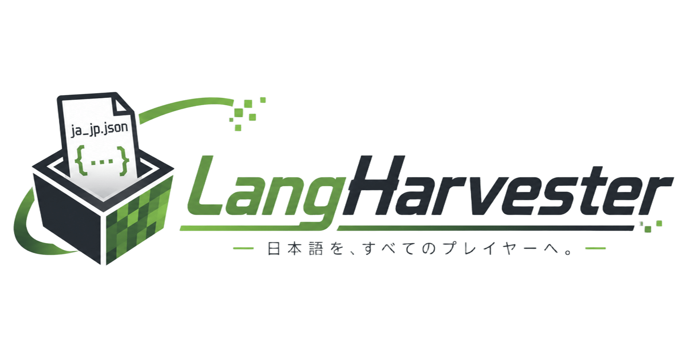

<!-- ヘッダー画像 -->
<p align="center">
  
</p>

<h1 align="center">LangHarvester</h1>

<p align="center">
  <strong>Minecraft MODから日本語リソースパックを自動生成</strong>
</p>

<p align="center">
  
  
  
  
  
</p>

<p align="center">
  <a href="#-概要">概要</a> •
  <a href="#-特徴">特徴</a> •
  <a href="#-スクリーンショット">スクリーンショット</a> •
  <a href="#-インストール">インストール</a> •
  <a href="#-使い方">使い方</a> •
  <a href="#-開発者向け">開発者向け</a>
</p>

---

## 📖 概要

**LangHarvester** は、Minecraft MODサーバー運営者が直面する「**MODに日本語翻訳（ja_jp.json）が含まれていても、サーバー側で言語を強制できない**」という問題を解決するデスクトップアプリケーションです。

MODのJARファイルから自動的に日本語言語ファイルを抽出し、**リソースパック**として1つにまとめることで、サーバー参加者全員に日本語表示を強制することが可能になります。

### なぜ必要なのか？

- 🔍 MODサーバーではクライアント側の言語設定を強制できない
- 📦 各MODが個別に `ja_jp.json` を提供しているが、サーバーでは反映されない
- 🔧 JARファイルを直接編集するのは手間がかかり、MOD更新のたびに作業が発生する

**LangHarvester** はこの問題を解決するために開発されました。

---

## ✨ 特徴

| 機能 | 説明 |
|------|------|
| 🚀 **ワンクリック生成** | MODフォルダを選択し、出力ファイル名を入力するだけでリソースパックを自動生成 |
| 📁 **フォルダ参照** | ダイアログから直感的にMODフォルダを選択可能 |
| 🔍 **自動スキャン** | サブフォルダを含めて再帰的にJARファイルを探索 |
| 🌏 **多言語対応** | デフォルトは日本語（ja_jp）ですが、設定変更で他言語にも対応 |
| ⚙️ **バージョン設定** | pack_formatを手動で設定可能（1.19.3〜最新版対応） |
| 📊 **リアルタイムログ** | 抽出状況やスキップしたMODを即座に確認 |
| 🎨 **モダンUI** | ダッシュボード風の見やすいインターフェース |
| 💾 **自動保存** | 実行ファイルと同じ階層に出力ファイルを保存 |

---

## 📸 スクリーンショット

### ダッシュボード画面
<p align="center">
  
</p>

### 設定画面
<p align="center">
  
</p>

### ヘルプ画面
<p align="center">
  
</p>

### 実行例
<p align="center">
  
</p>

---

## 💻 インストール

### インストーラー版（推奨）

1. [Releases](https://github.com/yourusername/langharvester/releases) から `LangHarvester_Setup.exe` をダウンロード
2. ダウンロードしたファイルを実行
3. 画面の指示に従ってインストール
4. デスクトップに作成されたショートカットから起動

### ポータブル版

1. [Releases](https://github.com/yourusername/langharvester/releases) から `LangHarvester.exe` をダウンロード
2. 任意のフォルダに配置
3. ダブルクリックで起動

---

## 🎮 使い方

### 基本的な操作フロー

1. **MODフォルダを選択**
   - 「参照」ボタンをクリックして、MODが入っているフォルダを選択
   - または、直接パスを入力

2. **出力ファイル名を入力**
   - 生成するリソースパックのファイル名を入力（例: `resourcepack`）
   - `.zip` は自動的に付与されます

3. **リソースパックを生成**
   - 「リソースパックを生成」ボタンをクリック
   - 処理が完了するまで待機

4. **生成されたリソースパックを使用**
   - 実行ファイルと同じ階層に `.zip` ファイルが生成されます
   - Minecraftのリソースパックフォルダに配置して適用

### 設定のカスタマイズ

- **pack_format**: リソースパックのバージョン形式を変更
  - `15`: 1.19.3〜1.19.4
  - `26`: 1.20.5〜1.21.4（デフォルト）
  - `48`: 1.21〜1.21.4
  - `61`: 1.21.5+

- **抽出言語**: 抽出する言語ファイルを変更
  - 日本語（ja_jp）: デフォルト
  - 中国語（zh_cn）
  - 韓国語（ko_kr）
  - 英語（en_us）

---

## 🛠 開発者向け

### システム要件

| 項目 | 要件 |
|------|------|
| OS | Windows 10 / 11（64bit）|
| Go | 1.21 以上 |
| Node.js | 18 以上 |
| Wails CLI | 2.15.0 以上 |

### 開発環境のセットアップ

```bash
# 1. Wails CLI をインストール
go install github.com/wailsapp/wails/v2/cmd/wails@latest

# 2. リポジトリをクローン
git clone https://github.com/momo-noki/langharvester.git
cd langharvester

# 3. 依存関係をインストール
cd frontend
npm install
cd ..

# 4. 開発モードで実行
wails dev
